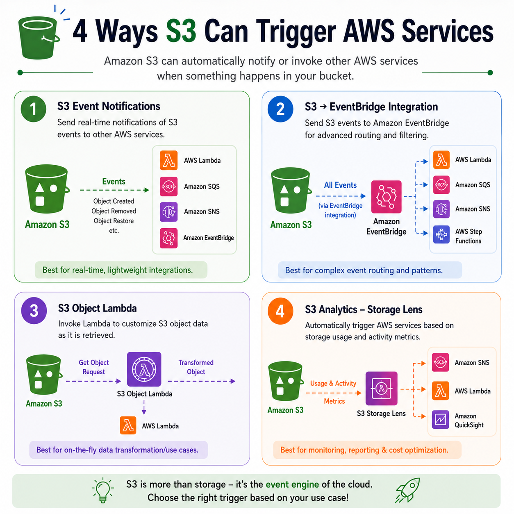
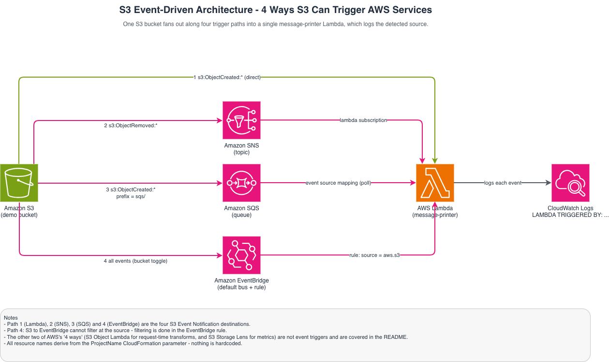

# S3 Event-Driven Architecture — Demo

A hands-on demo of **how Amazon S3 can trigger downstream AWS services**. A single
CloudFormation stack provisions all the supporting infrastructure; you then walk through four
scenarios, wiring each S3 event notification by hand and watching a single Lambda report **which
source invoked it** in CloudWatch Logs.



## Architecture

One S3 bucket fans out along four trigger paths into one `message-printer` Lambda, which logs the
detected source and forwards nothing else:

```
                          ┌──▶ (direct)                       ──┐
S3 (demo bucket) ─────────┼──▶ Amazon SNS  ──▶ subscription ───┤
                          ├──▶ Amazon SQS  ──▶ poll (mapping) ─┼──▶ Lambda ──▶ CloudWatch Logs
                          └──▶ EventBridge ──▶ rule(aws.s3) ───┘        "LAMBDA TRIGGERED BY: ..."
```

The editable diagram is in [S3_Event_Driven_Architecture.drawio](S3_Event_Driven_Architecture.drawio)
()
(open at [draw.io](https://app.diagrams.net)).

### The four trigger mechanisms

| # | Path | AWS feature | Best for |
|---|------|-------------|----------|
| 1 | S3 → Lambda | Event Notification → Lambda | Real-time, lightweight, lowest latency |
| 2 | S3 → SNS → Lambda | Event Notification → SNS | Fan-out to many subscribers, decoupling |
| 3 | S3 → SQS → Lambda | Event Notification → SQS | Buffering bursts, retries, batching |
| 4 | S3 → EventBridge → Lambda | EventBridge integration | Complex, content-based routing |

> **The other two of AWS's "4 ways" in the reference image** — **S3 Object Lambda** (transforms
> object data at *request* time) and **S3 Storage Lens** (storage usage/activity *metrics*) — are
> not event-notification triggers, so they are out of scope for these scenarios and mentioned here
> only for completeness.

## What the stack creates

[Infra/s3-event-demo.yaml](Infra/s3-event-demo.yaml) provisions:

- An **S3 bucket** (with no notification config — you add that per scenario).
- The **`message-printer` Lambda** (code inlined; mirrors [print_trigger_lambda.py](print_trigger_lambda.py)).
- An **SNS topic** (+ Lambda subscription + policy letting S3 publish).
- An **SQS queue** (+ policy letting S3 send + SQS→Lambda event source mapping).
- An **EventBridge rule** on the default bus matching `source: aws.s3`, targeting the Lambda.
- All required **IAM roles and invoke permissions**, plus a CloudWatch **log group**.

Every name is derived from the `ProjectName` parameter plus the account/region — **nothing is
hardcoded**. The S3→destination *wiring* is intentionally left to you (that is the learning part).

## Prerequisites

- An AWS account and the **AWS CLI v2** configured (`aws configure`) with permissions to create
  S3, Lambda, SNS, SQS, EventBridge, IAM, and CloudWatch resources.
- `bash` (for the helper scripts).

## Deploy

```bash
# Defaults: ProjectName=s3-event-demo, stack name=s3-event-demo, region from your AWS CLI config.
./Infra/deploy.sh

# Or customize:
PROJECT_NAME=my-demo STACK_NAME=my-demo-stack REGION=us-east-1 ./Infra/deploy.sh
```

Equivalent raw command:

```bash
aws cloudformation deploy \
  --template-file Infra/s3-event-demo.yaml \
  --stack-name s3-event-demo \
  --capabilities CAPABILITY_NAMED_IAM \
  --parameter-overrides ProjectName=s3-event-demo
```

On success the script prints the **stack outputs**. You'll use these throughout the scenarios:

| Output | Use |
|--------|-----|
| `BucketName` | The bucket to upload/delete test files in |
| `LambdaFunctionName` | The Lambda whose CloudWatch Logs you watch |
| `LogGroupName` / `LogsConsoleLink` | Where trigger messages appear |
| `SnsTopicArn` | Scenario 2 destination |
| `SqsQueueArn` / `SqsQueueUrl` | Scenario 4 destination |

Read them again at any time:

```bash
aws cloudformation describe-stacks --stack-name s3-event-demo \
  --query 'Stacks[0].Outputs' --output table
```

## Run the scenarios

Work through them in order — each builds on the stack outputs above:

1. [Scenario 1 — S3 → Lambda](Trigger_Examples/Scenario_1.md)
2. [Scenario 2 — S3 → SNS → Lambda](Trigger_Examples/Scenario_2.md)
3. [Scenario 3 — S3 → EventBridge → Lambda](Trigger_Examples/Scenario_3.md)
4. [Scenario 4 — S3 → SQS → Lambda](Trigger_Examples/Scenario_4.md)

After each, open the Lambda's CloudWatch Logs (use the `LogsConsoleLink` output) and look for
**`LAMBDA TRIGGERED BY: S3 / SNS / SQS / EventBridge`**.

## Clean up

Tear everything down with one command — it empties the bucket first (CloudFormation can't delete a
non-empty bucket), then deletes the stack and waits:

```bash
./Infra/destroy.sh
# or: PROJECT_NAME=my-demo STACK_NAME=my-demo-stack REGION=us-east-1 ./Infra/destroy.sh
```
**`ENSURE TO DELETE RESOURCES CREATED and DOUBLE CHECK IN AWS CONSOLE FOR ANY ORPHAN RESOURCES WHICH MAY NOT BE DELETED BY destroy.sh COMMAND`**

## Repository layout

```
.
├── README.md
├── .gitignore
├── print_trigger_lambda.py            # Readable reference copy of the Lambda code
├── 4_ways_to_Trigger_S3_Events.png    # Reference image
├── S3_Event_Driven_Architecture.drawio
├── S3_test_file_1.txt                 # Sample files to upload during testing
├── S3_test_file_2.txt
├── Infra/
│   ├── s3-event-demo.yaml             # CloudFormation template (the whole stack)
│   ├── deploy.sh
│   └── destroy.sh
└── Trigger_Examples/
    ├── Scenario_1.md                  # S3 -> Lambda
    ├── Scenario_2.md                  # S3 -> SNS -> Lambda
    ├── Scenario_3.md                  # S3 -> EventBridge -> Lambda
    └── Scenario_4.md                  # S3 -> SQS -> Lambda
```
